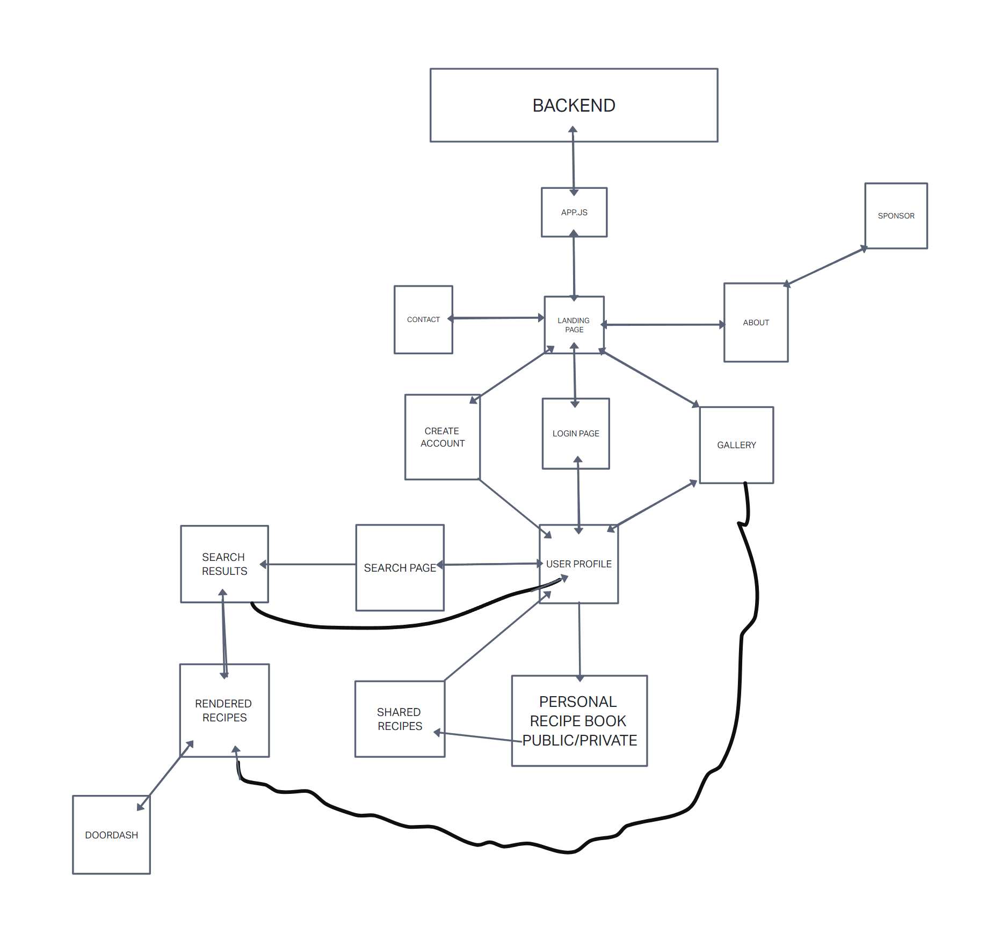
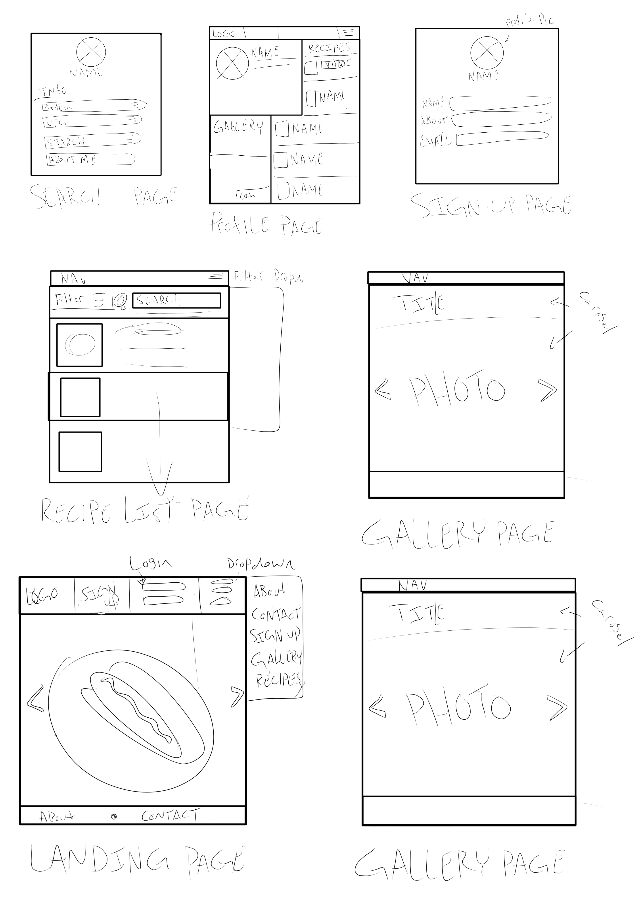
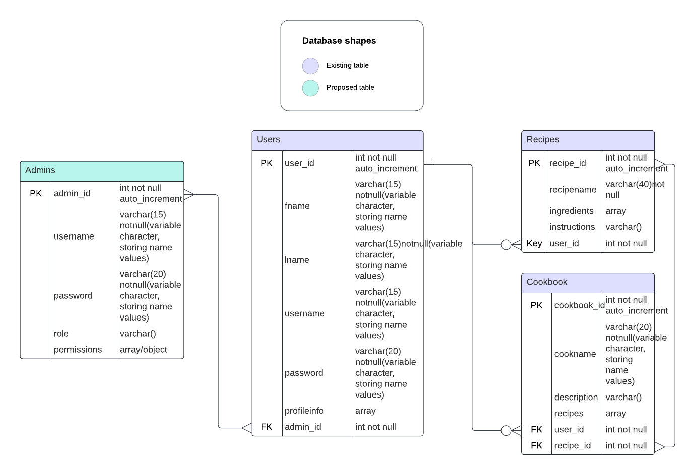

# Fridge-Forager
301-final-project

## User Stories 

As a __, I want __, so that ___

User stories can be described as:

Short, simple, and open for interpretation
Presented to the developer (from the client) as the behavior they wish to see in their app. The user story should not present a solution.
Should clearly communicate the end goal of the user
Includes Acceptance Testing

1. As someone who is constantly overworked(self-proclaimed), I want to be able to access this app when I forget to go to the grocery store, so that I can use what I have on hand to make myself a healthy meal.
2. As a poor college student, I HATE throwing away food, so I would like recipes to make some bomb ramen.
3. As someone with dietriarian restrictions, I want to be able to eat good meals with the food Im allow to eat, so that I wont starve.
4. As a pet lover, I want to use this app to feed myself instead of always feeding my pets, so that I can be healthy and provide for the pets who eat all my own food.
5. As a food cook lover, I want a way to be able to upload my recipes and photos of food I professionally cooked, so that I can show the world how awesome my food is.

## Software Requirements

### Vision

Fridge Forager is an application where a user can input what ingredients they have available to them. Once entered, using various APIs, the user will receive feedback which displays the available recipes. The biggest pain point this project is solving is to help people not waste food and give them ideas on new recipes they'll discover on the app. It also solves the problem of an individual not knowing what to make with what ingredients they have available. This product will help people manage their ingredients and inspire them to make new recipes and give them ideas on new recipes they'll discover on the app.

### Scope (In/Out)

- IN
    - The app will provide recipes for users
    - The app will allow users to search for recipes
    - The app will allow users to upload pictures of food
    - The app will allow users to upload comments
    - The app will allow users to like recipes
    - The app will allow users to create, delete and share recipes

- OUT
    - The app will not provide addresses from users
    - The app will not be allowing users to make changes on other users profiles and recipes.

### MVP

- What is the minimum required for you to present on your demo day?

    - User profile
    - User authentication
    - Input form
    - API generated recipes
    - Photo upload
    - Calorie Counting/Nutrition Facts

- Stretch goals

    - User Comments
    - Mini-Game
    - API Integration with DoorDash
    - Dietary Restrictions
    - Food Allergies
    - Like Photo/Gallery of most liked photos
    - Input personal recipes
    - Premium Features

### Functional Requirements

1. An admin can create and delete user accounts
2. A user can update their profile information
3. A user can search shared recipes by other users, upload pictures of food, and upload comments
4. A user can like and unlike recipes, create and delete recipes
5. A user can have private information regarding recipes

### Non-Functional Requirements

1. Security: To make sure users can access information that they are privided to them. Secure sensitive information such as passwords.

2. Usability: Ensure users can understand the purpose of the app as well as navigate through it with ease. Maintain high accessibility standards for the application.

### DOMAIN MODELING

### WIREFRAME

### DataBase Schema Diagram

=======
By Charlie Arriaga, Niles Thompson, Brett Fort, Kaitlin Davis, and DeAndre Ordonez

## Project Summary

Fridge Forager is an application where a user can input what ingredients they have available to them. Once entered, using various APIs, the user will receive feedback which displays the available recipes.

## Cooperation Plan

### Key Strengths
- Niles: Back-end dev and databases
- Charlie: Problem solving and aesthetics
- Brett: Troubleshooting
- Kaitlin: Food enthusiast and perseverance
- DeAndre: Adaptability and creativity

### How can you best utilize strengths in the project execution?

- Niles: Can create complex back-end algorithms and complex database connections.
- Charlie: Can do research and front-end development.
- Brett:  Can do research and figure out new concepts.
- Kaitlin: Can work on aesthetics and presentation.
- DeAndre: Can fill in wherever we need him.

### Professional Competencies to Work On

- Niles: Front-end technical skills
- Charlie: Customer orientation and UX experience
- Brett: Communication and documentation
- Kailtin: Communication and project management
- DeAndre: Stay within scope, reasonable planning

### Knowing that every person in your team needs to understand all aspects of the project, how do you plan to approach the day-to-day work?

We will utilize the project management tool and have daily meetings and work in shifts.

## Conflict Plan

### What will be your group’s process to resolve conflict, when it arises?

Democracy baby, otherwise address JB

### What will your team do if one person is taking over the project and not letting the other members contribute?

We will communicate with the person what they are doing and talk it out. Take it to court.

### How will you approach each other and the challenges of the project knowing that it is impossible for all members to be at the exact same place in understanding and skill level?

We will delegate tasks based off of people's strengths and weaknesses so that people will have equal time improving their skills in every area.

### How will you raise concerns to members who are not adequately contributing?

We will communicate with the person what they are doing and talk it out. Take it to court. And utilize the project management app.

### How and when will you escalate the conflict if your resolution attempts are unsuccessful?

Have an intervention. Involve the instructor.

## Communication Plan

### What hours will you be available to communicate?
- Niles: 8am - 10pm pst
- Charlie: 7am - 9pm pst
- Brett: 6am - 7pm pst
- Kaitlin: 8am - 10pm cst
- DeAndre: 8am - 10pm est

### What platforms will you use to communicate (ie. Slack, phone …)?
- Slack
- Remo
- Trello

### How often will you take breaks?
Once every 2 hours

### What is your plan if you start to fall behind?

We will re-evaluate our MVP

### How will you communicate after hours and on the weekend?

Slack

### What is your strategy for ensuring everyone’s voice is heard?

Open door policy, maintaining respect, and democracy

### How will you ensure that you are creating a safe environment where everyone feels comfortable speaking up?

We will maintain openness, respect for each other, and an open-door policy

## Work Plan

### How you will identify tasks, assign tasks, know when they are complete, and manage work in general?

We will use a project management tool.

### What project management tool will be used?

We will use Trello

## Presentation Deck

https://docs.google.com/presentation/d/1Z3xyRV5Iem3gDFIELFhcN6e78JitjgewFNIN9nYdsx0/edit?usp=sharing

## Git Workflow

### What components of your project will live on GitHub?

All of them save for the database.

### How will you share the repository with your teammates?

We will create an organization on GitHub

### What is your Git flow?

We will have a dev fork that we will merge any off branches with and merge the dev fork back into main when everything is done.

### Will you be using a PR review workflow?

We will require two reviews and approvals from other teammates for a pull request.

